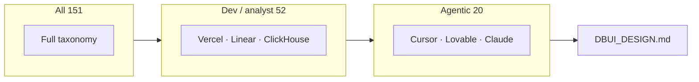

# DESIGN.md Category Audit

**For:** Databricks design leadership · **Corpus:** 151 Open Design packages · **Date:** July 22, 2026

> **Read in browser:** open [`CATEGORY-AUDIT.html`](CATEGORY-AUDIT.html) — sidebar nav, coverage bars, printable.

---

## Contents

1. [At a glance](#at-a-glance)
2. [Three lenses](#three-lenses)
3. [Metadata categories](#part-1--metadata-categories)
4. [Content topics](#part-2--content-topics)
5. [Dev / analyst cohort](#part-3--dev--analyst)
6. [Agentic-first cohort](#part-4--agentic-first)
7. [Databricks guidelines](#part-5--databricks-guidelines)
8. [File plan](#file-plan)

---

## At a glance

| | |
|---|---|
| **Packages studied** | 151 |
| **Dev / analyst reference set** | 52 (Vercel, Linear, ClickHouse, Notion…) |
| **Agentic-first reference set** | 20 (Cursor, Lovable, Claude…) |
| **Content topics to document** | 14 |

### Four findings

1. **Two category layers** — product tags (AI & LLM, Developer Tools…) vs doc sections (Color, Typography, Agent Guide…). DBUI needs both.

2. **Dev/analyst docs are prescriptive** — 83% include an Agent Prompt Guide; 25% include Motion. Optimize for tables and rules, not brand poetry.

3. **Agentic systems add runnable §9** — hex quick-reference, copy-paste prompts, numbered non-negotiables.

4. **Corpus gaps = Databricks opportunities** — 0% have iconography or data-viz sections. DBUI already leads here.

### Proposed Databricks category

```
Enterprise B2B · Data & AI Platform · Light-first workbench UI
```

---

## Three lenses



| Lens | n | Question it answers |
|------|--:|---------------------|
| **All** | 151 | What exists in the ecosystem? What to ignore? |
| **Dev / analyst** | 52 | How should a data workbench look and read? |
| **Agentic-first** | 20 | How should Genie / agent surfaces be documented for LLMs? |

**Overlap:** Cursor and Lovable are in both dev and agentic. Vercel and Linear are dev-only.

---

## Part 1 · Metadata categories

*How Open Design tags products — not the sections inside each file.*

### Use for DBUI (compare here)

| Category | n | §9 Agent guide | Examples |
|----------|--:|---------------:|----------|
| AI & LLM | 15 | 80% | claude, perplexity, cohere |
| Backend & Data | 9 | 100% | clickhouse, supabase, sentry |
| Developer Tools | 9 | 78% | cursor, vercel, raycast |
| Productivity & SaaS | 12 | 75% | linear-app, notion, resend |
| Design & Creative | 7 | 86% | figma, framer, airtable |

### Ignore as comparables

Automotive · Fintech consumer · E-Commerce · Media & Consumer · Bold & Expressive · Style presets (neon, brutalism…)

*Full matrix:* `data/meta-category-matrix.tsv`

---

## Part 2 · Content topics

*The 14 section types agents actually read inside DESIGN.md.*

### Table stakes (≥90% in dev/analyst cohort)

| Topic | Dev/analyst | Agentic |
|-------|------------:|--------:|
| Visual theme | 100% | 100% |
| Typography | 100% | 100% |
| Components | 100% | 100% |
| Layout | 100% | 100% |
| Color | 96% | 85% |
| Do's / Don'ts | 92% | 90% |

### Prioritize for DBUI

| Topic | Dev/analyst | Why |
|-------|------------:|-----|
| **Agent prompt guide** | 83% | Highest leverage for LLM output quality |
| Depth & elevation | 79% | Workbench needs explicit shadow/border rules |
| Responsive | 79% | Multi-panel shell needs breakpoint table |

### Deprioritize or point elsewhere

| Topic | Dev/analyst | DBUI approach |
|-------|------------:|---------------|
| Motion | 25% | Minimal; defer to component JSDoc |
| Voice & tone | 8% | Point to `brandvoice.md` |

### DBUI differentiators (corpus gaps)

| Topic | Corpus | DBUI already has |
|-------|--------|------------------|
| Accessibility | ~0% dedicated § | Focus-ring spec across components |
| Iconography | 0% | 451 icons + `icon-index.csv` |
| Data visualization | 0% | Chart tokens, dense tables, Status/Badge |

---

## Part 3 · Dev / analyst

**52 systems** for engineers and analysts in product UI — not marketing sites.

### Sub-cohorts

| Group | n | Signature |
|-------|--:|-----------|
| AI & LLM | 15 | Agent guide, token tables |
| Developer Tools | 9 | Precision, monospace, restrained palette |
| Productivity & SaaS | 12 | Density, sidebar layouts, one accent |
| Backend & Data | 9 | Tables, status semantics, high information density |
| Design & Creative | 7 | Component-forward patterns |

### Patterns to adopt

- One chromatic accent (DuBois blue) for primary actions only
- Achromatic surfaces; semantic color for status only
- Typography table: role → size → weight → line-height
- Two-layer layout: platform chrome + content surface
- 13px body is on-spec for this cohort (DBUI default)

---

## Part 4 · Agentic-first

**20 systems** where the AI agent *is* the product.

`agentic` · `claude` · `cohere` · `cursor` · `elevenlabs` · `huggingface` · `lovable` · `minimax` · `mission-control` · `mistral-ai` · `ollama` · `openai` · `opencode-ai` · `perplexity` · `replicate` · `runwayml` · `together-ai` · `voltagent` · `warp` · `x-ai`

### What agentic adds on top of dev/analyst

| Pattern | Prevalence |
|---------|------------|
| §9 with literal hex color reference | ~90% of files with §9 |
| 5–8 copy-paste example prompts | Common |
| Numbered non-negotiables | Common |
| Iteration checklist (8–10 questions) | Common |
| "One component at a time" | Frequent |

### DBUI implication

| Surface | Pattern |
|---------|---------|
| Product chrome | Dev/analyst rules (Linear, Vercel) |
| Genie / assistant panel | Agentic §9 (Cursor, Lovable) |
| Accent | DuBois blue + `--ai-gradient` on AI surfaces only |

---

## Part 5 · Databricks guidelines

*One table — codify in `packages/dbui/DBUI_DESIGN.md`.*

| # | Category | Peers do | DBUI should do | Priority |
|--:|----------|----------|----------------|----------|
| 1 | **Visual theme** | Narrative + key characteristics | Two-layer shell; signature: *13px · DuBois blue · shell-first · sentence case* | High |
| 2 | **Color** | Role tables with hex | 4-col table (role · Tailwind · var · hex); one accent; ai-gradient for Genie only | High |
| 3 | **Typography** | Hierarchy table; 2–3 weights | Display / Text / Mono; 400+600; 13px base; sentence case | High |
| 4 | **Components** | Variant prose | Pointer to `component-index.md`; no raw HTML; Base UI `render` prop | Medium |
| 5 | **Layout** | 8px grid; sidebar patterns | Always `<Base>`; compositions A–E; four spacing tiers | High |
| 6 | **Depth** | Shadow tier table | xs controls · md popovers · lg dialogs · per-variant focus | High |
| 7 | **Motion** | Low in dev cohort | Minimal; hover/press tokens; 150–200ms overlays | Low |
| 8 | **Responsive** | Breakpoint tables | Base shell collapse; tables scroll; tree → drawer | Medium |
| 9 | **Voice** | Rare in dev tools | Pointer to `brandvoice.md` | Low |
| 10 | **Do's / Don'ts** | Paired bullets | `anti-slop.md` + wrong-cohort redirect | High |
| 11 | **Accessibility** | Corpus gap | Focus rings, contrast pairs, border-only validation | High |
| 12 | **Iconography** | Corpus gap | Mandatory `icon-index.csv` lookup; 451 monoline icons | High |
| 13 | **Data viz** | Corpus gap | Chart tokens; dense tables; Status/Badge components | High |
| 14 | **Agent guide** | Hex ref + prompts + checklist | **§9 centerpiece** — non-negotiables + 5–8 example prompts | **Critical** |

---

## File plan

| File | Role |
|------|------|
| `packages/dbui/DBUI_DESIGN.md` | All 14 topics (~350 lines) |
| `packages/dbui/CLAUDE.md` | Rules, Figma MCP, lint |
| `packages/dbui/docs/component-index.md` | §4 pointer |
| `packages/dbui/docs/icon-index.csv` | §12 pointer |
| `packages/dbui/composition.md` | §5 pointer |
| `packages/dbui/brandvoice.md` | §9 copy pointer |

---

## Regenerate

```bash
node scripts/design-md-category-audit.mjs
node scripts/generate-category-audit-html.mjs
open research/design-md-corpus/CATEGORY-AUDIT.html
```

**Data files:** `research/design-md-corpus/data/category-audit.json` · `meta-category-matrix.tsv`
